# Architecture Documentation

**Last updated:** 2026-04-13

## Table of Contents

- [System Overview](#system-overview)
- [High-Level Architecture](#high-level-architecture)
- [Component Diagram](#component-diagram)
- [Application Bootstrap](#application-bootstrap)
- [Bot Layer](#bot-layer)
  - [Command Flows](#command-flows)
  - [State Management](#state-management)
  - [Rate Limiting](#rate-limiting)
- [Parser Layer](#parser-layer)
  - [Parser Interface](#parser-interface)
  - [Base Parser & Pagination](#base-parser--pagination)
  - [Parser Registry](#parser-registry)
  - [Site-Specific Parsers](#site-specific-parsers)
- [Database Layer](#database-layer)
  - [Schema](#schema)
  - [Entity Relationship Diagram](#entity-relationship-diagram)
  - [Data Access Layer](#data-access-layer)
  - [Migrations](#migrations)
- [Scheduler & Digest](#scheduler--digest)
- [Data Flows](#data-flows)
  - [Search Flow](#search-flow)
  - [Daily Digest Flow](#daily-digest-flow)
  - [Favorite Price Tracking](#favorite-price-tracking)
- [Configuration](#configuration)
- [Deployment](#deployment)
- [Error Handling](#error-handling)
- [Logging](#logging)

---

## System Overview

**property-bot** is a Telegram bot for searching Serbian real estate websites. It scrapes listings from 5 sources, tracks price changes on favorited listings, and sends daily digests. The UI is in Russian; search keywords are in Serbian.

**Key capabilities:**

- Multi-source property search with combinable search profiles
- Price tracking with daily change notifications
- Favorites management with persistent storage
- Configurable per-user site preferences

---

## High-Level Architecture

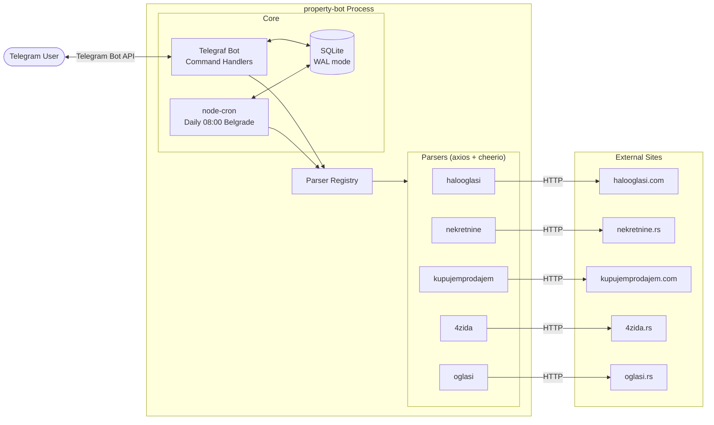
```mermaid
graph LR
    User([Telegram User])

    subgraph Process["property-bot Process"]
        direction TB

        subgraph Core["Core"]
            direction LR
            Bot[Telegraf Bot<br/>Command Handlers]
            Scheduler[node-cron<br/>Daily 08:00 Belgrade]
            DB[(SQLite<br/>WAL mode)]
        end

        Registry[Parser Registry]

        subgraph Parsers["Parsers (axios + cheerio)"]
            direction LR
            P1[halooglasi]
            P2[nekretnine]
            P3[kupujemprodajem]
            P4[4zida]
            P5[oglasi]
        end
    end

    subgraph Sites["External Sites"]
        direction LR
        S1[halooglasi.com]
        S2[nekretnine.rs]
        S3[kupujemprodajem.com]
        S4[4zida.rs]
        S5[oglasi.rs]
    end

    User <-->|Telegram Bot API| Bot
    Bot --> Registry
    Scheduler --> Registry
    Bot <--> DB
    Scheduler <--> DB
    Registry --> Parsers
    P1 -->|HTTP| S1
    P2 -->|HTTP| S2
    P3 -->|HTTP| S3
    P4 -->|HTTP| S4
    P5 -->|HTTP| S5
```

---

## Component Diagram

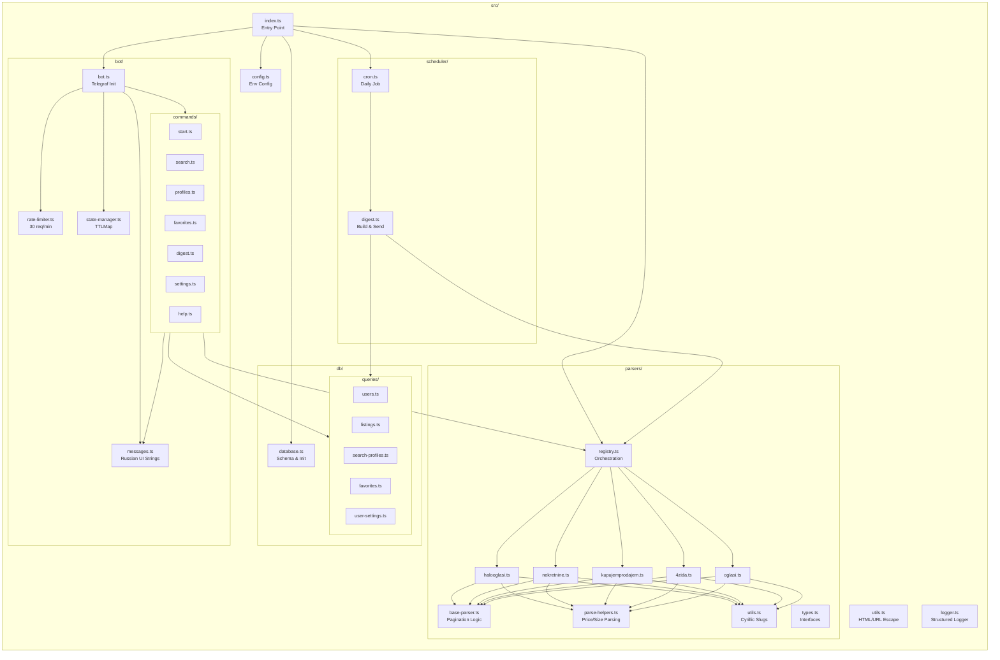
```mermaid
graph LR
    subgraph "src/"
        index[index.ts<br/>Entry Point]
        config[config.ts<br/>Env Config]
        utils[utils.ts<br/>HTML/URL Escape]
        logger[logger.ts<br/>Structured Logger]

        subgraph bot["bot/"]
            bot_main[bot.ts<br/>Telegraf Init]
            messages[messages.ts<br/>Russian UI Strings]
            rate_limiter[rate-limiter.ts<br/>30 req/min]
            state_mgr[state-manager.ts<br/>TTLMap]

            subgraph commands["commands/"]
                cmd_start[start.ts]
                cmd_search[search.ts]
                cmd_profiles[profiles.ts]
                cmd_favorites[favorites.ts]
                cmd_digest[digest.ts]
                cmd_settings[settings.ts]
                cmd_help[help.ts]
            end
        end

        subgraph parsers["parsers/"]
            types_p[types.ts<br/>Interfaces]
            base[base-parser.ts<br/>Pagination Logic]
            registry[registry.ts<br/>Orchestration]
            parse_helpers[parse-helpers.ts<br/>Price/Size Parsing]
            p_utils[utils.ts<br/>Cyrillic Slugs]
            halo[halooglasi.ts]
            nekr[nekretnine.ts]
            kp[kupujemprodajem.ts]
            zida[4zida.ts]
            ogl[oglasi.ts]
        end

        subgraph db["db/"]
            database[database.ts<br/>Schema & Init]
            subgraph queries["queries/"]
                q_users[users.ts]
                q_listings[listings.ts]
                q_profiles[search-profiles.ts]
                q_favorites[favorites.ts]
                q_settings[user-settings.ts]
            end
        end

        subgraph scheduler["scheduler/"]
            cron[cron.ts<br/>Daily Job]
            digest[digest.ts<br/>Build & Send]
        end
    end

    index --> config & bot_main & database & registry & cron
    bot_main --> commands & rate_limiter & state_mgr & messages
    commands --> registry & queries & messages
    cron --> digest
    digest --> registry & queries
    registry --> halo & nekr & kp & zida & ogl
    halo & nekr & kp & zida & ogl --> base & parse_helpers & p_utils
```

---

## Application Bootstrap

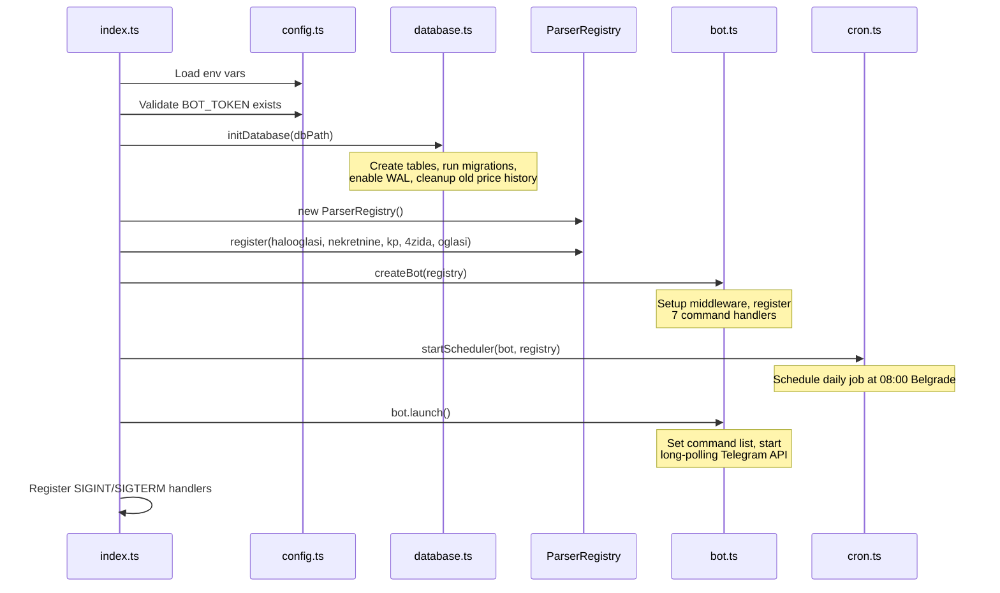
```mermaid
sequenceDiagram
    participant Main as index.ts
    participant Config as config.ts
    participant DB as database.ts
    participant Registry as ParserRegistry
    participant Bot as bot.ts
    participant Cron as cron.ts

    Main->>Config: Load env vars
    Main->>Config: Validate BOT_TOKEN exists
    Main->>DB: initDatabase(dbPath)
    Note over DB: Create tables, run migrations,<br/>enable WAL, cleanup old price history
    Main->>Registry: new ParserRegistry()
    Main->>Registry: register(halooglasi, nekretnine, kp, 4zida, oglasi)
    Main->>Bot: createBot(registry)
    Note over Bot: Setup middleware, register<br/>7 command handlers
    Main->>Cron: startScheduler(bot, registry)
    Note over Cron: Schedule daily job at 08:00 Belgrade
    Main->>Bot: bot.launch()
    Note over Bot: Set command list, start<br/>long-polling Telegram API
    Main->>Main: Register SIGINT/SIGTERM handlers
```

---

## Bot Layer

### Command Flows

#### /start — User Registration

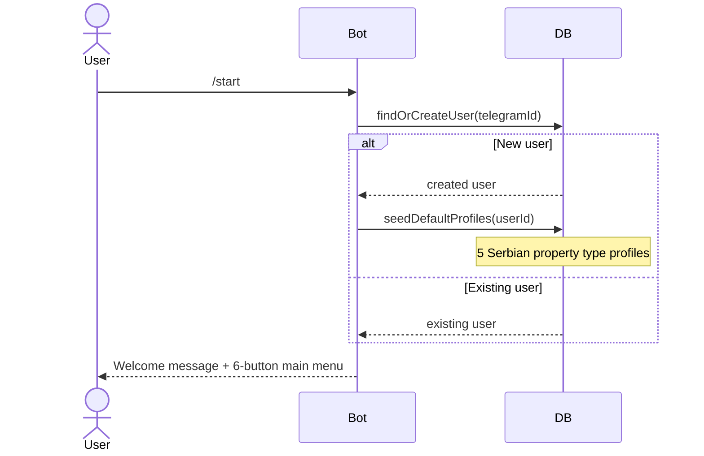
```mermaid
sequenceDiagram
    actor User
    participant Bot
    participant DB

    User->>Bot: /start
    Bot->>DB: findOrCreateUser(telegramId)
    alt New user
        DB-->>Bot: created user
        Bot->>DB: seedDefaultProfiles(userId)
        Note over DB: 5 Serbian property type profiles
    else Existing user
        DB-->>Bot: existing user
    end
    Bot-->>User: Welcome message + 6-button main menu
```

#### /search — Multi-Phase Search Wizard

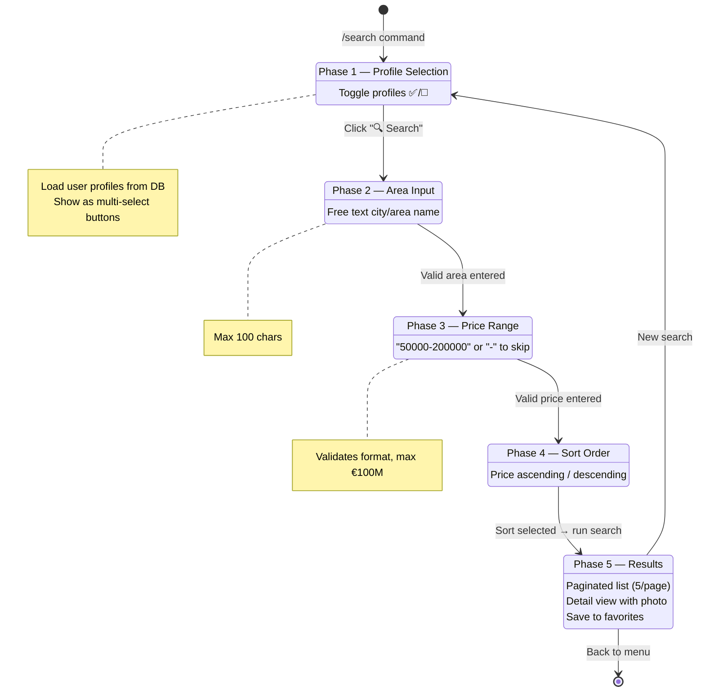
```mermaid
stateDiagram-v2
    [*] --> Selecting: /search command

    Selecting: Phase 1 — Profile Selection
    Selecting: Toggle profiles ✅/◻️
    note right of Selecting: Load user profiles from DB<br/>Show as multi-select buttons

    EnteringArea: Phase 2 — Area Input
    EnteringArea: Free text city/area name
    note right of EnteringArea: Max 100 chars

    EnteringPrice: Phase 3 — Price Range
    EnteringPrice: "50000-200000" or "-" to skip
    note right of EnteringPrice: Validates format, max €100M

    ChoosingSort: Phase 4 — Sort Order
    ChoosingSort: Price ascending / descending

    Browsing: Phase 5 — Results
    Browsing: Paginated list (5/page)
    Browsing: Detail view with photo
    Browsing: Save to favorites

    Selecting --> EnteringArea: Click "🔍 Search"
    EnteringArea --> EnteringPrice: Valid area entered
    EnteringPrice --> ChoosingSort: Valid price entered
    ChoosingSort --> Browsing: Sort selected → run search
    Browsing --> Selecting: New search
    Browsing --> [*]: Back to menu
```

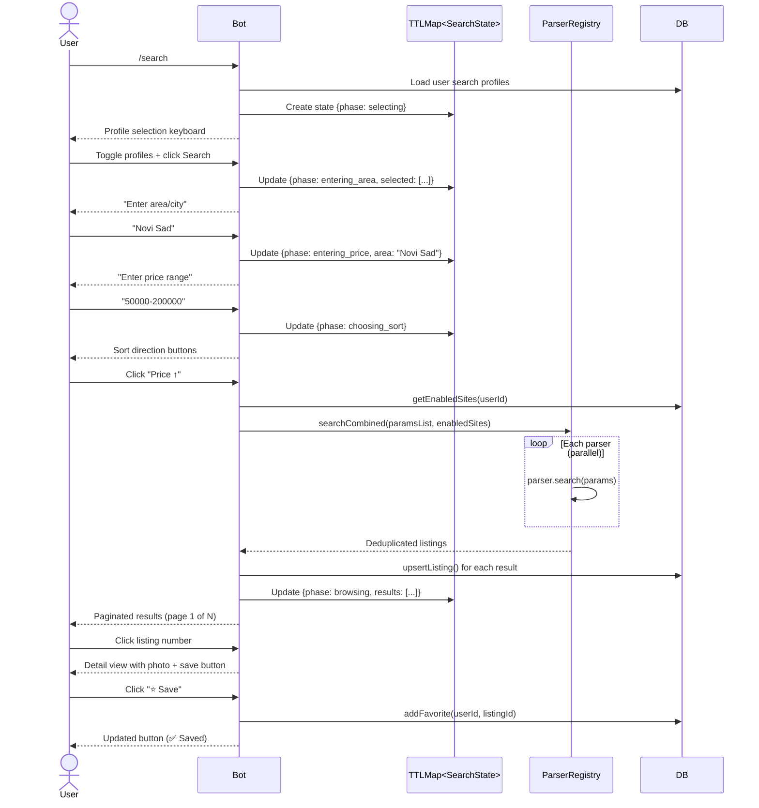
```mermaid
sequenceDiagram
    actor User
    participant Bot
    participant State as TTLMap<SearchState>
    participant Registry as ParserRegistry
    participant DB

    User->>Bot: /search
    Bot->>DB: Load user search profiles
    Bot->>State: Create state {phase: selecting}
    Bot-->>User: Profile selection keyboard

    User->>Bot: Toggle profiles + click Search
    Bot->>State: Update {phase: entering_area, selected: [...]}
    Bot-->>User: "Enter area/city"

    User->>Bot: "Novi Sad"
    Bot->>State: Update {phase: entering_price, area: "Novi Sad"}
    Bot-->>User: "Enter price range"

    User->>Bot: "50000-200000"
    Bot->>State: Update {phase: choosing_sort}
    Bot-->>User: Sort direction buttons

    User->>Bot: Click "Price ↑"
    Bot->>DB: getEnabledSites(userId)
    Bot->>Registry: searchCombined(paramsList, enabledSites)

    loop Each parser (parallel)
        Registry->>Registry: parser.search(params)
    end

    Registry-->>Bot: Deduplicated listings
    Bot->>DB: upsertListing() for each result
    Bot->>State: Update {phase: browsing, results: [...]}
    Bot-->>User: Paginated results (page 1 of N)

    User->>Bot: Click listing number
    Bot-->>User: Detail view with photo + save button

    User->>Bot: Click "⭐ Save"
    Bot->>DB: addFavorite(userId, listingId)
    Bot-->>User: Updated button (✅ Saved)
```

#### /profiles — Profile CRUD

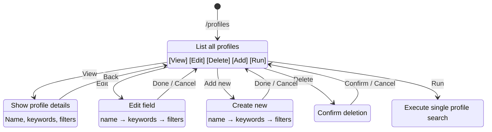
```mermaid
stateDiagram-v2
    [*] --> ListView: /profiles

    ListView: List all profiles
    ListView: [View] [Edit] [Delete] [Add] [Run]

    DetailView: Show profile details
    DetailView: Name, keywords, filters

    EditWizard: Edit field
    EditWizard: name → keywords → filters

    AddWizard: Create new
    AddWizard: name → keywords → filters

    DeleteConfirm: Confirm deletion

    RunSearch: Execute single profile search

    ListView --> DetailView: View
    ListView --> EditWizard: Edit
    ListView --> AddWizard: Add new
    ListView --> DeleteConfirm: Delete
    ListView --> RunSearch: Run
    DetailView --> ListView: Back
    EditWizard --> ListView: Done / Cancel
    AddWizard --> ListView: Done / Cancel
    DeleteConfirm --> ListView: Confirm / Cancel
```

#### /digest — On-Demand Digest

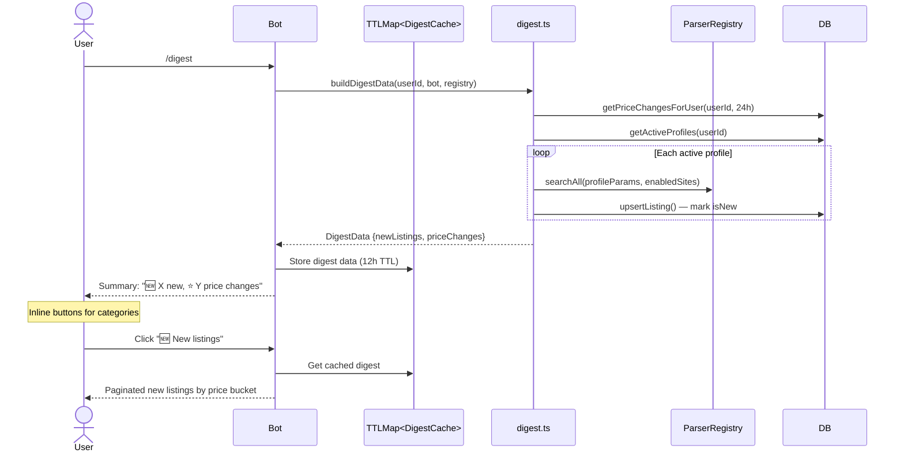
```mermaid
sequenceDiagram
    actor User
    participant Bot
    participant Cache as TTLMap<DigestCache>
    participant Digest as digest.ts
    participant Registry as ParserRegistry
    participant DB

    User->>Bot: /digest
    Bot->>Digest: buildDigestData(userId, bot, registry)
    Digest->>DB: getPriceChangesForUser(userId, 24h)
    Digest->>DB: getActiveProfiles(userId)

    loop Each active profile
        Digest->>Registry: searchAll(profileParams, enabledSites)
        Digest->>DB: upsertListing() — mark isNew
    end

    Digest-->>Bot: DigestData {newListings, priceChanges}
    Bot->>Cache: Store digest data (12h TTL)
    Bot-->>User: Summary: "🆕 X new, ⭐ Y price changes"
    Note over User: Inline buttons for categories

    User->>Bot: Click "🆕 New listings"
    Bot->>Cache: Get cached digest
    Bot-->>User: Paginated new listings by price bucket
```

#### /settings — Site Preferences

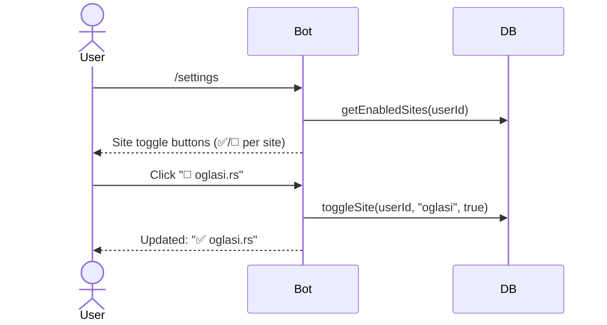
```mermaid
sequenceDiagram
    actor User
    participant Bot
    participant DB

    User->>Bot: /settings
    Bot->>DB: getEnabledSites(userId)
    Bot-->>User: Site toggle buttons (✅/◻️ per site)

    User->>Bot: Click "◻️ oglasi.rs"
    Bot->>DB: toggleSite(userId, "oglasi", true)
    Bot-->>User: Updated: "✅ oglasi.rs"
```

### State Management

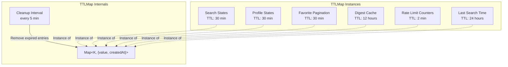
```mermaid
graph TB
    subgraph "TTLMap Instances"
        SS[Search States<br/>TTL: 30 min]
        PS[Profile States<br/>TTL: 30 min]
        FS[Favorite Pagination<br/>TTL: 30 min]
        DC[Digest Cache<br/>TTL: 12 hours]
        RL[Rate Limit Counters<br/>TTL: 2 min]
        LS[Last Search Time<br/>TTL: 24 hours]
    end

    subgraph "TTLMap Internals"
        direction TB
        Map["Map&lt;K, {value, createdAt}&gt;"]
        Timer[Cleanup Interval<br/>every 5 min]
        Timer -->|Remove expired entries| Map
    end

    SS & PS & FS & DC & RL & LS -.->|Instance of| Map
```

**TTLMap** is a generic `Map` wrapper that:

- Auto-expires entries after a configurable TTL
- Runs a periodic cleanup interval (default 5 min)
- Resets entry age on `set()` updates
- Provides `destroy()` to clear the cleanup timer

### Rate Limiting

```mermaid
flowchart TD
    Update[Incoming Telegram Update] --> Exempt{Is /start or /help?}
    Exempt -->|Yes| Pass[Allow through]
    Exempt -->|No| Count{Requests in<br/>60s window?}
    Count -->|< 30| Pass
    Count -->|≥ 30| Type{Update type?}
    Type -->|Callback query| Toast[Show toast:<br/>"Too many requests"]
    Type -->|Other| Drop[Silently drop]
```

---

## Parser Layer

### Parser Interface

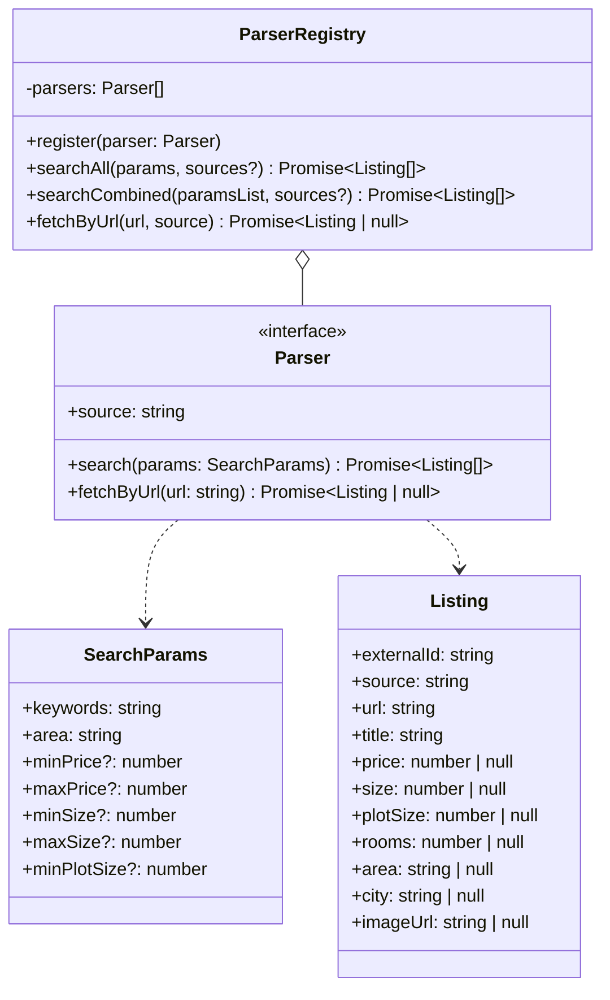
```mermaid
classDiagram
    class Parser {
        <<interface>>
        +source: string
        +search(params: SearchParams) Promise~Listing[]~
        +fetchByUrl(url: string) Promise~Listing | null~
    }

    class SearchParams {
        +keywords: string
        +area: string
        +minPrice?: number
        +maxPrice?: number
        +minSize?: number
        +maxSize?: number
        +minPlotSize?: number
    }

    class Listing {
        +externalId: string
        +source: string
        +url: string
        +title: string
        +price: number | null
        +size: number | null
        +plotSize: number | null
        +rooms: number | null
        +area: string | null
        +city: string | null
        +imageUrl: string | null
    }

    class ParserRegistry {
        -parsers: Parser[]
        +register(parser: Parser)
        +searchAll(params, sources?) Promise~Listing[]~
        +searchCombined(paramsList, sources?) Promise~Listing[]~
        +fetchByUrl(url, source) Promise~Listing | null~
    }

    ParserRegistry o-- Parser
    Parser ..> SearchParams
    Parser ..> Listing
```

### Base Parser & Pagination

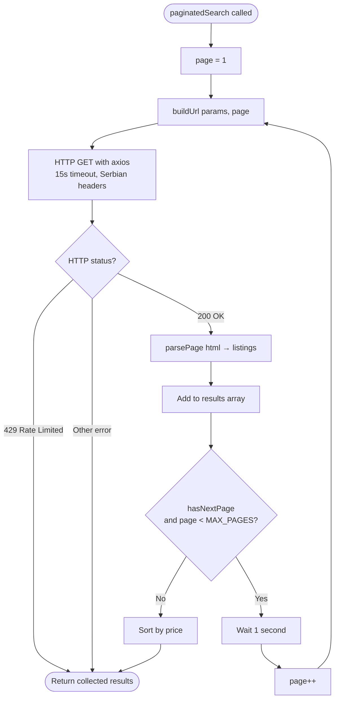
```mermaid
flowchart TD
    Start([paginatedSearch called]) --> Page1[page = 1]
    Page1 --> BuildURL[buildUrl params, page]
    BuildURL --> Fetch[HTTP GET with axios<br/>15s timeout, Serbian headers]
    Fetch --> Status{HTTP status?}
    Status -->|429 Rate Limited| Stop([Return collected results])
    Status -->|Other error| Stop
    Status -->|200 OK| Parse[parsePage html → listings]
    Parse --> Collect[Add to results array]
    Collect --> HasNext{hasNextPage<br/>and page < MAX_PAGES?}
    HasNext -->|No| Sort[Sort by price]
    HasNext -->|Yes| Delay[Wait 1 second]
    Delay --> NextPage[page++]
    NextPage --> BuildURL
    Sort --> Stop
```

### Parser Registry

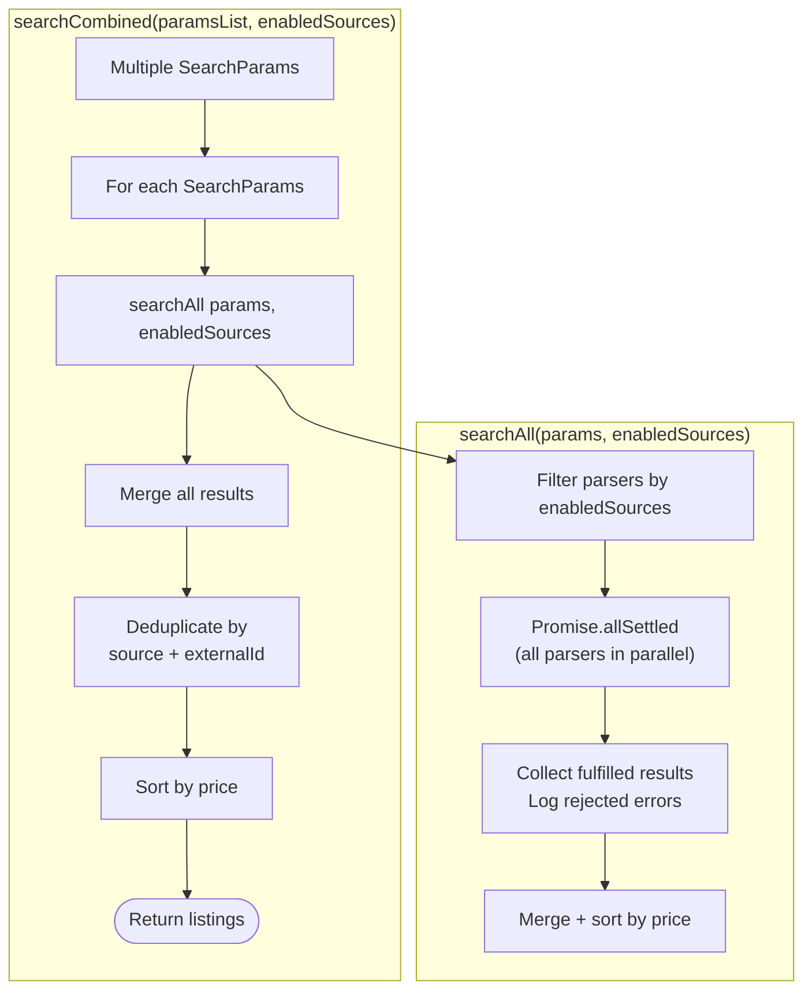
```mermaid
flowchart TD
    subgraph "searchCombined(paramsList, enabledSources)"
        Input[Multiple SearchParams] --> Loop[For each SearchParams]
        Loop --> SA[searchAll params, enabledSources]
        SA --> Merge[Merge all results]
        Merge --> Dedup[Deduplicate by<br/>source + externalId]
        Dedup --> Sort[Sort by price]
        Sort --> Output([Return listings])
    end

    subgraph "searchAll(params, enabledSources)"
        Filter[Filter parsers by enabledSources] --> Parallel["Promise.allSettled<br/>(all parsers in parallel)"]
        Parallel --> Collect[Collect fulfilled results<br/>Log rejected errors]
        Collect --> MergeAll[Merge + sort by price]
    end

    SA --> Filter
```

### Site-Specific Parsers

| Parser              | Source              | Extraction Strategy                    | ID Strategy                 |
| ------------------- | ------------------- | -------------------------------------- | --------------------------- |
| **halooglasi**      | halooglasi.com      | CSS selectors, `data-id` attributes    | `data-id` from listing card |
| **nekretnine**      | nekretnine.rs       | CSS selectors                          | URL slug extraction         |
| **kupujemprodajem** | kupujemprodajem.com | JSON-LD first, CSS fallback            | From listing URL/ID         |
| **4zida**           | 4zida.rs            | JSON-LD `ItemList` first, CSS fallback | From JSON-LD or URL         |
| **oglasi**          | oglasi.rs           | Schema.org microdata attributes        | From microdata              |

**Parse Helpers** (`parse-helpers.ts`):

- `parsePrice(raw)` — Strip separators, extract numeric EUR value
- `parseSize(text)` — Extract m² value from various formats
- `parseRooms(text)` — Handle "2+1", "3 sob", etc.
- `parsePlotSize(text)` — Convert m² to ares (÷100)

---

## Database Layer

### Schema

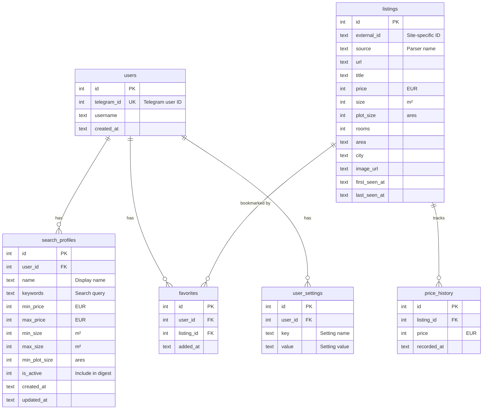
```mermaid
erDiagram
    users {
        int id PK
        int telegram_id UK "Telegram user ID"
        text username
        text created_at
    }

    search_profiles {
        int id PK
        int user_id FK
        text name "Display name"
        text keywords "Search query"
        int min_price "EUR"
        int max_price "EUR"
        int min_size "m²"
        int max_size "m²"
        int min_plot_size "ares"
        int is_active "Include in digest"
        text created_at
        text updated_at
    }

    listings {
        int id PK
        text external_id "Site-specific ID"
        text source "Parser name"
        text url
        text title
        int price "EUR"
        int size "m²"
        int plot_size "ares"
        int rooms
        text area
        text city
        text image_url
        text first_seen_at
        text last_seen_at
    }

    price_history {
        int id PK
        int listing_id FK
        int price "EUR"
        text recorded_at
    }

    favorites {
        int id PK
        int user_id FK
        int listing_id FK
        text added_at
    }

    user_settings {
        int id PK
        int user_id FK
        text key "Setting name"
        text value "Setting value"
    }

    users ||--o{ search_profiles : "has"
    users ||--o{ favorites : "has"
    users ||--o{ user_settings : "has"
    listings ||--o{ price_history : "tracks"
    listings ||--o{ favorites : "bookmarked by"
```

### Entity Relationship Diagram

**Unique constraints:**

- `listings(source, external_id)` — one entry per listing per site
- `favorites(user_id, listing_id)` — one bookmark per user per listing
- `user_settings(user_id, key)` — one value per setting per user

**Indexes:**

- `idx_price_history_listing` on `price_history(listing_id, recorded_at)`
- `idx_favorites_user` on `favorites(user_id)`

### Data Access Layer

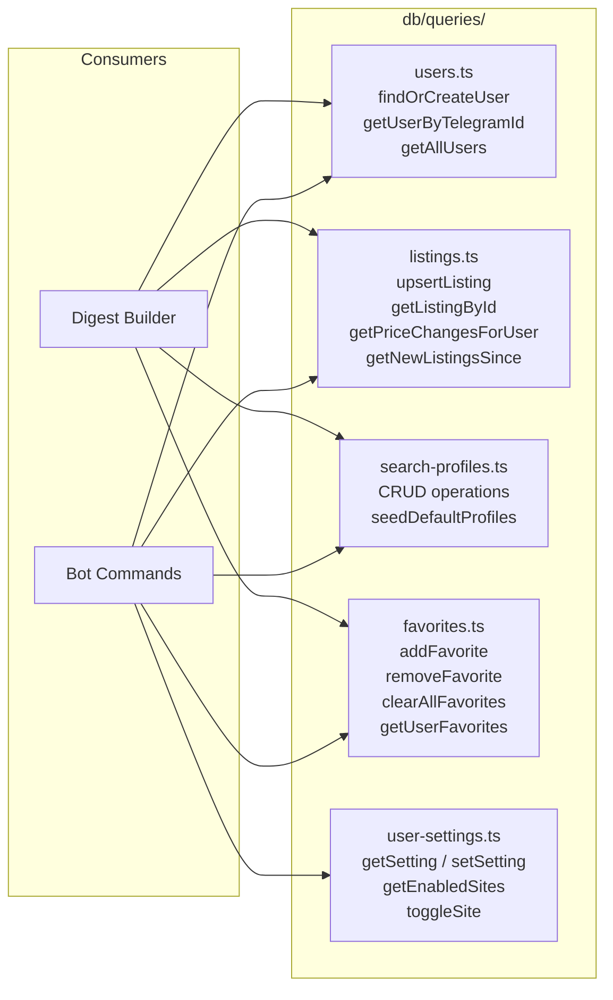
```mermaid
graph LR
    subgraph "db/queries/"
        users_q[users.ts<br/>findOrCreateUser<br/>getUserByTelegramId<br/>getAllUsers]
        listings_q[listings.ts<br/>upsertListing<br/>getListingById<br/>getPriceChangesForUser<br/>getNewListingsSince]
        profiles_q[search-profiles.ts<br/>CRUD operations<br/>seedDefaultProfiles]
        favorites_q[favorites.ts<br/>addFavorite<br/>removeFavorite<br/>clearAllFavorites<br/>getUserFavorites]
        settings_q[user-settings.ts<br/>getSetting / setSetting<br/>getEnabledSites<br/>toggleSite]
    end

    subgraph Consumers
        Commands[Bot Commands]
        Digest[Digest Builder]
    end

    Commands --> users_q & listings_q & profiles_q & favorites_q & settings_q
    Digest --> users_q & listings_q & profiles_q & favorites_q
```

**Key behavior — `upsertListing()`:**

1. INSERT OR IGNORE the listing (by source + external_id)
2. UPDATE price, last_seen_at if listing already exists
3. If price changed, INSERT into `price_history`
4. Returns `{ id, isNew }` — `isNew` flags first-time inserts

### Migrations

Run automatically during `initDatabase()`:

1. Add `image_url` column to `listings` (if missing)
2. Drop obsolete `raw_data` column from `listings` (if present)
3. Cleanup `price_history` entries older than retention period (default 90 days)

---

## Scheduler & Digest

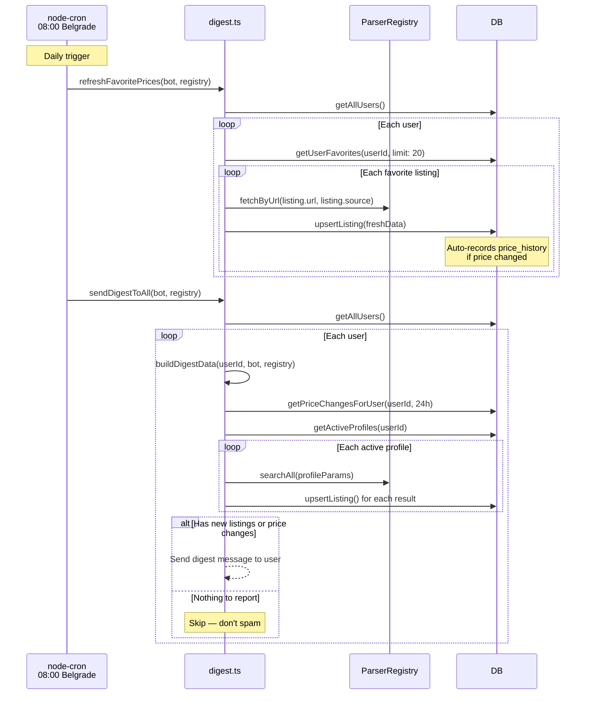
```mermaid
sequenceDiagram
    participant Cron as node-cron<br/>08:00 Belgrade
    participant Digest as digest.ts
    participant Registry as ParserRegistry
    participant DB

    Note over Cron: Daily trigger

    Cron->>Digest: refreshFavoritePrices(bot, registry)
    Digest->>DB: getAllUsers()

    loop Each user
        Digest->>DB: getUserFavorites(userId, limit: 20)
        loop Each favorite listing
            Digest->>Registry: fetchByUrl(listing.url, listing.source)
            Digest->>DB: upsertListing(freshData)
            Note over DB: Auto-records price_history<br/>if price changed
        end
    end

    Cron->>Digest: sendDigestToAll(bot, registry)
    Digest->>DB: getAllUsers()

    loop Each user
        Digest->>Digest: buildDigestData(userId, bot, registry)
        Digest->>DB: getPriceChangesForUser(userId, 24h)
        Digest->>DB: getActiveProfiles(userId)

        loop Each active profile
            Digest->>Registry: searchAll(profileParams)
            Digest->>DB: upsertListing() for each result
        end

        alt Has new listings or price changes
            Digest-->>Digest: Send digest message to user
        else Nothing to report
            Note over Digest: Skip — don't spam
        end
    end
```

**Digest message structure:**

```
📊 Дайджест от DD.MM.YYYY

🆕 X новых объявлений          [button: view by price bucket]
⭐ Y изменений цен             [button: view price changes]
```

**Price buckets for new listings:** < €50k, €50-100k, €100-200k, > €200k

---

## Data Flows

### Search Flow


```mermaid
flowchart LR
    A[User selects profiles<br/>+ enters area + price] --> B[Build SearchParams<br/>per selected profile]
    B --> C[registry.searchCombined]
    C --> D["Promise.allSettled<br/>(5 parsers × N profiles)"]
    D --> E[Deduplicate by<br/>source + externalId]
    E --> F[Sort by price]
    F --> G[upsertListing each<br/>into SQLite]
    G --> H[Paginate & display<br/>5 per page]
    H --> I[User browses<br/>detail views & saves]
```

### Daily Digest Flow

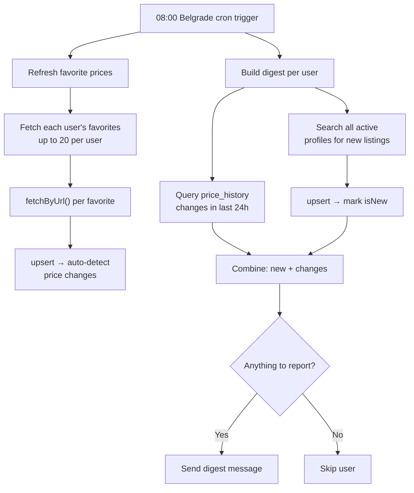
```mermaid
flowchart TB
    Cron[08:00 Belgrade cron trigger] --> Refresh[Refresh favorite prices]
    Refresh --> FetchFav[Fetch each user's favorites<br/>up to 20 per user]
    FetchFav --> FetchURL["fetchByUrl() per favorite"]
    FetchURL --> Upsert1[upsert → auto-detect<br/>price changes]

    Cron --> Build[Build digest per user]
    Build --> PriceQ[Query price_history<br/>changes in last 24h]
    Build --> ProfileQ[Search all active<br/>profiles for new listings]
    ProfileQ --> Upsert2[upsert → mark isNew]

    PriceQ --> Combine[Combine: new + changes]
    Upsert2 --> Combine
    Combine --> Send{Anything to report?}
    Send -->|Yes| Msg[Send digest message]
    Send -->|No| Skip[Skip user]
```

### Favorite Price Tracking

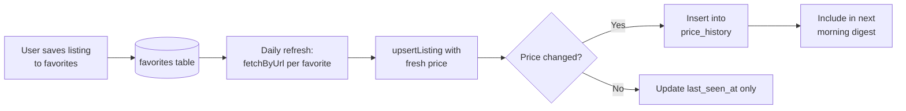
```mermaid
flowchart LR
    Save[User saves listing<br/>to favorites] --> DB1[(favorites table)]
    DB1 --> Daily[Daily refresh:<br/>fetchByUrl per favorite]
    Daily --> Upsert[upsertListing with<br/>fresh price]
    Upsert --> Changed{Price changed?}
    Changed -->|Yes| Record[Insert into<br/>price_history]
    Changed -->|No| Update[Update last_seen_at only]
    Record --> Digest[Include in next<br/>morning digest]
```

---

## Configuration

All settings loaded from environment variables via `src/config.ts`:

| Variable                       | Default                | Description                      |
| ------------------------------ | ---------------------- | -------------------------------- |
| `BOT_TOKEN`                    | _required_             | Telegram Bot API token           |
| `DB_PATH`                      | `data/property-bot.db` | SQLite database file path        |
| `SESSION_TTL_MS`               | `1800000` (30 min)     | User session/state timeout       |
| `SEARCH_COOLDOWN_MS`           | `30000` (30 sec)       | Minimum time between searches    |
| `MAX_PARSER_PAGES`             | `3`                    | Max pages to scrape per parser   |
| `REQUEST_TIMEOUT_MS`           | `15000` (15 sec)       | HTTP request timeout             |
| `PAGE_DELAY_MS`                | `1000` (1 sec)         | Delay between paginated requests |
| `RESULTS_PER_PAGE`             | `5`                    | Listings per page in results     |
| `FAVORITES_PER_PAGE`           | `5`                    | Listings per page in favorites   |
| `DIGEST_CRON`                  | `0 8 * * *`            | Cron expression for daily digest |
| `DIGEST_TIMEZONE`              | `Europe/Belgrade`      | Timezone for cron schedule       |
| `PRICE_HISTORY_RETENTION_DAYS` | `90`                   | Days to keep price history       |

---

## Deployment

```mermaid
graph TB
    subgraph "Docker Container"
        subgraph "Multi-Stage Build"
            Stage1[Stage 1: Build<br/>Install deps + tsc compile<br/>+ prune devDeps<br/>+ rebuild better-sqlite3]
            Stage2[Stage 2: Runtime<br/>Node.js 22 Alpine<br/>Copy dist/ + node_modules/]
            Stage1 --> Stage2
        end
        App[node dist/index.js]
    end

    subgraph "DigitalOcean VPS"
        Compose[docker-compose.yml]
        ENV[.env file]
        Volume[./data volume<br/>SQLite persistence]
    end

    Compose --> App
    ENV --> App
    Volume <--> App

    subgraph "Docker Compose Config"
        direction TB
        Restart[restart: unless-stopped]
        Logging[JSON log driver<br/>10MB × 3 rotations]
    end
```

**Docker Compose** mounts `./data:/app/data` to persist the SQLite database across container restarts.

---

## Error Handling

```mermaid
flowchart TD
    subgraph "Parser Errors"
        PE1[Network timeout] --> PE_R[Log warning<br/>Return empty array]
        PE2[HTTP 429] --> PE_R2[Log warning<br/>Stop pagination]
        PE3[Malformed HTML] --> PE_R3[Skip listing<br/>Continue parsing]
        PE4[Parser throws] --> PE_R4["allSettled catches<br/>Other parsers unaffected"]
    end

    subgraph "Command Errors"
        CE1[Session expired] --> CE_R1[Reply: session expired msg]
        CE2[DB error] --> CE_R2[Reply: generic error msg]
        CE3[Photo upload fails] --> CE_R3[Fallback to text message]
    end

    subgraph "Global Error Handler"
        GE[Unhandled error in handler] --> GE_R[Log error<br/>Reply with generic error + help button]
    end
```

**Design principle:** Parsers fail gracefully via `Promise.allSettled` — one parser breaking never blocks results from others.

---

## Logging

Structured logging via `src/logger.ts`:

```
[2026-04-13T08:00:01.234Z] INFO [scheduler] Starting daily digest
[2026-04-13T08:00:02.567Z] WARN [halooglasi] HTTP 429 on page 2 {"url":"..."}
[2026-04-13T08:00:05.890Z] ERROR [nekretnine] Network timeout {"url":"...","timeout":15000}
```

**Log modules:** `main`, `config`, `bot`, `rate-limiter`, `search`, `digest`, `scheduler`, and one per parser (`halooglasi`, `nekretnine`, `kupujemprodajem`, `4zida`, `oglasi`).
